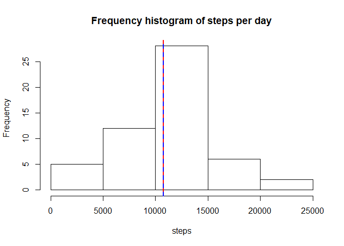
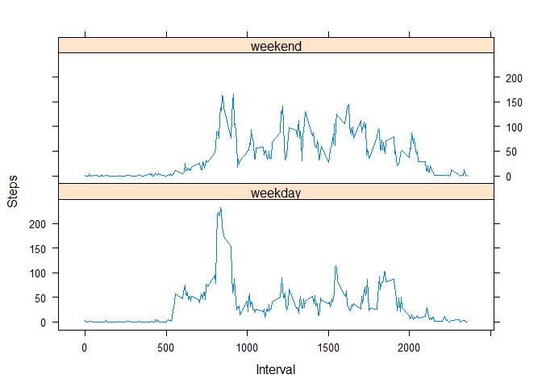

Introduction
------------

This is the Coursera Reproducible Research Course Project 1 created in
html using knitr.

First some housekeeping (echo on, warning & message off).

    knitr::opts_chunk$set(echo=TRUE, warning=FALSE, message=FALSE)

1. Loading and preprocessing the data
-------------------------------------

Load the zip file from the url supplied and unzip, then read data into
the data frame 'dats'. Note: to save on data downloads and computing
time, the code will only do this the first time (i.e. if files do not
already exist).

    url <- "https://d396qusza40orc.cloudfront.net/repdata%2Fdata%2Factivity.zip"
    zips <- "dataset.zip"
    file <- "activity.csv"
    if(!file.exists(zips)){download.file(url,zips, mode = "wb")}
    if(!file.exists(file)){unzip(zips, files = NULL, exdir=".")}
    dats <- read.csv(file = file, header=TRUE)
    str(dats)

    ## 'data.frame':    17568 obs. of  3 variables:
    ##  $ steps   : int  NA NA NA NA NA NA NA NA NA NA ...
    ##  $ date    : Factor w/ 61 levels "2012-10-01","2012-10-02",..: 1 1 1 1 1 1 1 1 1 1 ...
    ##  $ interval: int  0 5 10 15 20 25 30 35 40 45 ...

Convert the dates (column 2) from factors to dates. (Happily they are in
a tidy format, so this is simple.)

2. Total steps per day
----------------------

Calculate the total number of steps each day and store these in the
array 'steps'. Use this calculate the mean and median of the steps per
day, then display a frequency histogram of the steps per day, and the
mean and median.

    dats$date <- as.Date(dats$date)
    steps <- with(dats, tapply(steps, date, sum))
    meansteps <- mean(steps, na.rm=TRUE)
    medsteps <- median(steps, na.rm=TRUE)
    paste("Mean of steps (ignoring missing values):", round(meansteps,2))

    ## [1] "Mean of steps (ignoring missing values): 10766.19"

    paste("Median of steps (ignoring missing values):", medsteps)

    ## [1] "Median of steps (ignoring missing values): 10765"

    hist(steps, main="Frequency histogram of steps per day")
    abline(v=meansteps, col="red", lty=1, lwd=2)
    abline(v=medsteps, col="blue", lty=2, lwd=2)

In fact the mean (red) and median (blue) are so close together that they
are indistinguishable on the histogram.

3. Daily pattern
----------------

Calculate number of steps per 5-minute interval, averaged across all
days. Store as array 'avesteps'. Make a line plot and calculate the
interval with the most steps on average. This interval is displayed in
blue on the plot.

    means <- function(x){
            mean(x, na.rm=TRUE)
    }
    avesteps <- with(dats, tapply(steps, interval, means))
    maxsteps <- which(avesteps==max(avesteps))
    plot(x=names(avesteps),y=avesteps, type="l", lwd =2, xlab = "Interval (in seconds)", ylab = "Average steps")
    abline(v=names(maxsteps), col="blue")

    paste("Maximum average number of steps was", 
          round(avesteps[maxsteps],0), "during the 5-minute interval after the", 
          names(maxsteps), "minute mark.")

    ## [1] "Maximum average number of steps was 206 during the 5-minute interval after the 835 minute mark."

4. Calculate number of missing measurements.
--------------------------------------------

    head(dats)

    ##   steps       date interval
    ## 1    NA 2012-10-01        0
    ## 2    NA 2012-10-01        5
    ## 3    NA 2012-10-01       10
    ## 4    NA 2012-10-01       15
    ## 5    NA 2012-10-01       20
    ## 6    NA 2012-10-01       25

    paste("In the original data frame there are", 
          sum(is.na(dats[,1])), "missing measurements out of",
          length(dats[,1]), "total measurements:",
          round(sum(is.na(dats[,1]))/length(dats[,1])*100,1),"%.")

    ## [1] "In the original data frame there are 2304 missing measurements out of 17568 total measurements: 13.1 %."

5. Replace missing values and check.
------------------------------------

The new dataset (I call it 'dats2') is identical to the original apart
from these filled values:

    dats2 <- dats
    for (i in 1:nrow(dats2)) {
        if (is.na(dats2$steps[i])) {
            dats2$steps[i] <- 
                    avesteps[which(dats2$interval[i] == as.integer(names(avesteps)))]
        }
    }
    colSums(is.na(dats2))

    ##    steps     date interval 
    ##        0        0        0

    head(dats2)

    ##       steps       date interval
    ## 1 1.7169811 2012-10-01        0
    ## 2 0.3396226 2012-10-01        5
    ## 3 0.1320755 2012-10-01       10
    ## 4 0.1509434 2012-10-01       15
    ## 5 0.0754717 2012-10-01       20
    ## 6 2.0943396 2012-10-01       25

Plot another frequency histogram of the total steps per day, together
with their mean (red) and median (blue).

    steps2 <- with(dats2, tapply(steps, date, sum))
    hist(steps2, main="Frequency histogram of steps per day \n (missing data filled)")
    abline(v=mean(steps2), col="red", lty=1, lwd=2)
    abline(v=median(steps2), col="blue", lty=2, lwd=2)

    paste("Mean steps before filling missing data was", round(meansteps,2), "and after filling was", round(mean(steps2),2),"This was the same because I used the mean values to fill the missing data.")

    ## [1] "Mean steps before filling missing data was 10766.19 and after filling was 10766.19 This was the same because I used the mean values to fill the missing data."

    paste("Median steps before filling missing data was", medsteps, "and after filling was",median(steps2)," ...Slightly different.")

    ## [1] "Median steps before filling missing data was 10765 and after filling was 10766.1886792453  ...Slightly different."

6. Differences between weekdays and weekends
--------------------------------------------

First get the days of the week (in Mandarin because of my operating
system...) and use them to create a new variable 'days' (either
'weekday' or 'weekend').

    dats2$days <- factor(format(dats2$date, "%A"))
    table(dats2$days)

    ## 
    ## 星期二 星期六 星期日 星期三 星期四 星期五 星期一 
    ##   2592   2304   2304   2592   2592   2592   2592

    levels(dats2$days) <- list(weekday = c("星期二","星期二","星期三","星期四","星期五"),
                               weekend = c("星期六","星期日"))
    table(dats2$days)

    ## 
    ## weekday weekend 
    ##   10368    4608

Now create a panel plot the containing a time series plot of the
5-minute interval (x-axis) and the average number of steps taken,
averaged across all weekday days or weekend days (y-axis). (In the style
in the Github ReadMe file.)

    avesteps3 <- aggregate(dats2$steps, 
                          list(interval = as.numeric(as.character(dats2$interval)), 
                               weekdays = dats2$days),
                          FUN = "mean")
    names(avesteps3)[3] <- "meansteps"
    library(lattice)
    xyplot(avesteps3$meansteps ~ avesteps3$interval | avesteps3$weekdays, 
           layout = c(1, 2), type = "l", 
           xlab = "Interval", ylab = "Steps")

ENDE
